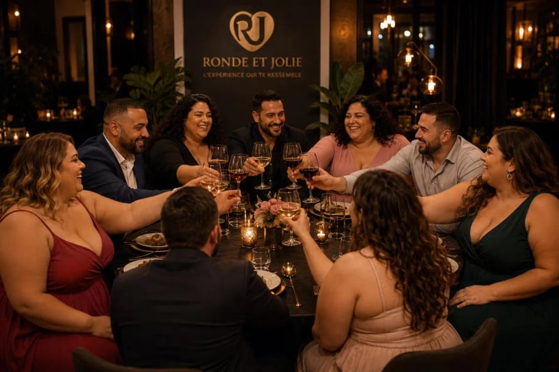

# Ronde et Jolie — Hero one-page

Site web statique HTML/CSS/JS reproduisant fidèlement la maquette PSD fournie, **avec les vraies photos de la communauté**.

## 📁 Structure

```
ronde-et-jolie/
├── index.html              # Structure du hero
├── styles.css              # Design system + composants + responsive
├── script.js               # Burger menu, parallax souris, smooth scroll
└── assets/
    └── photos/             # 18 fichiers : 3 photos × 3 tailles × 2 formats
        ├── photo-1-diner@1x.webp     (800×800, 70 KB)
        ├── photo-1-diner@1x.jpg      (800×800, 116 KB)
        ├── photo-1-diner@2x.webp     (1600×1600, 156 KB) ← Retina
        ├── photo-1-diner@2x.jpg      (1600×1600, 315 KB)
        ├── photo-1-diner@3x.webp     (896×896, 78 KB)    ← Print max
        ├── photo-1-diner@3x.jpg      (896×896, 137 KB)
        ├── photo-2-apero@1x.webp     (800×600, 56 KB)
        ├── photo-2-apero@1x.jpg      (800×600, 89 KB)
        ├── photo-2-apero@2x.webp     (1600×1200, 127 KB)
        ├── photo-2-apero@2x.jpg      (1600×1200, 245 KB)
        ├── photo-2-apero@3x.webp     (1225×918, 94 KB)
        ├── photo-2-apero@3x.jpg      (1225×918, 169 KB)
        ├── photo-3-cuisine@1x.webp   (800×600, 79 KB)
        ├── photo-3-cuisine@1x.jpg    (800×600, 114 KB)
        ├── photo-3-cuisine@2x.webp   (1600×1200, 186 KB)
        ├── photo-3-cuisine@2x.jpg    (1600×1200, 318 KB)
        ├── photo-3-cuisine@3x.webp   (1225×918, 136 KB)
        └── photo-3-cuisine@3x.jpg    (1225×918, 219 KB)
```

**Taille totale** : ~2.8 Mo (mais grâce au `srcset`, un mobile ne charge que ~200 KB de photos).

## 📸 Photos intégrées

| Position | Photo | Contexte |
|---|---|---|
| Cercle central | Dîner aux chandelles avec backdrop "Ronde et Jolie — L'expérience qui te ressemble" | Soirée privée |
| Top-right | Apéro/cocktails avec vue Tour Eiffel | After-work parisien |
| Bottom-right | Atelier cuisine en tabliers RJ | Cours collectif |

## 🎯 Pourquoi `<picture>` + srcset ?

Chaque photo est servie en **WebP moderne** (50% plus léger que JPG) avec **fallback JPG** pour Safari anciens. Le navigateur choisit automatiquement :

- **Écran standard** (1x) : version 800px
- **Écran Retina/4K** (2x) : version 1600px

Code utilisé dans `index.html` :

```html
<picture>
    <source type="image/webp"
            srcset="assets/photos/photo-1-diner@1x.webp 1x,
                    assets/photos/photo-1-diner@2x.webp 2x">
    
</picture>
```

## 🚀 Mise en ligne

Aucune dépendance, c'est du statique pur :

- **Vercel / Netlify** : glissez le dossier sur leur dashboard
- **FTP classique** : uploadez `ronde-et-jolie/` à la racine de votre hébergement
- **Ouverture directe** : double-cliquez `index.html` (le `file://` fonctionnera mais préférez Live Server pour le dev)

## 💻 Dev local

Le plus simple : **VS Code + Live Server** (extension Ritwick Dey).
1. Ouvrez le dossier dans VS Code
2. Clic droit sur `index.html` > "Open with Live Server"
3. Auto-refresh à chaque sauvegarde

Alternative terminal :
```bash
cd ronde-et-jolie
python3 -m http.server 8080
# → http://localhost:8080
```

## 🎨 Design system (extrait)

Couleurs (variables CSS dans `:root` de `styles.css`) :
- Fond : `#0a0806` (noir profond)
- Or : `#d4a574` base / `#e8b87a` bright / `#b8895a` deep
- Crème : `#f5e6d3`

Typographies (Google Fonts) :
- Titres : **Cormorant Garamond** (serif italique élégant)
- Corps : **Inter**
- Manuscrit : **Caveat**

## ✨ Fonctionnalités intégrées

- ✅ Photos réelles avec WebP + fallback JPG + responsive srcset
- ✅ Soulignure or animée sous le titre italique (draw on load)
- ✅ Logo RJ vectoriel custom (cœur entrelacé)
- ✅ Cercles concentriques en fond avec rotation lente
- ✅ Grain SVG inline pour texture
- ✅ Parallax léger des photos au mouvement souris (desktop only)
- ✅ 4 piliers en cards avec glow au hover
- ✅ Cœur "battement" animé infini
- ✅ Burger menu mobile
- ✅ Responsive 3 breakpoints (1100px / 720px / 380px)
- ✅ `prefers-reduced-motion` respecté
- ✅ Accessibilité : alt descriptifs, aria-labels, contrastes WCAG AA
- ✅ Aucune dépendance externe à part Google Fonts

---

Livré par Harbane Agency · Mai 2026
